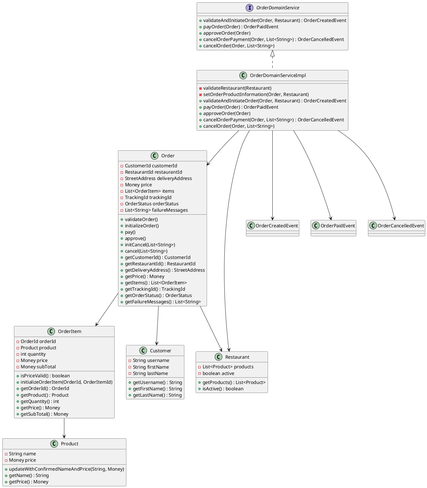

# Order Domain Core 設計

`order-domain-core` 模組包含了訂單服務的核心業務邏輯。以下是主要的類和介面的設計說明：

## OrderDomainService

`OrderDomainService` 是一個介面，定義了訂單服務的核心操作，包括驗證和初始化訂單、支付訂單、批准訂單、取消訂單支付和取消訂單。

```java
interface OrderDomainService {
    OrderCreatedEvent validateAndInitiateOrder(Order order, Restaurant restaurant);
    OrderPaidEvent payOrder(Order order);
    void approveOrder(Order order);
    OrderCancelledEvent cancelOrderPayment(Order order, List<String> failureMessages);
    void cancelOrder(Order order, List<String> failureMessages);
}
```

## OrderDomainServiceImpl

`OrderDomainServiceImpl` 是 `OrderDomainService` 的實現類，包含了具體的業務邏輯。

```java
class OrderDomainServiceImpl implements OrderDomainService {
    // ...existing code...
}
```

## Order

`Order` 類表示一個訂單，包含了訂單的詳細信息和狀態。

```java
class Order extends AggregateRoot<OrderId> {
    // ...existing code...
}
```

## OrderItem

`OrderItem` 類表示訂單中的一個項目，包含了產品、數量、價格等信息。

```java
class OrderItem extends BaseEntity<OrderItemId> {
    // ...existing code...
}
```

## Product

`Product` 類表示一個產品，包含了產品的名稱和價格。

```java
class Product extends BaseEntity<ProductId> {
    // ...existing code...
}
```

## Restaurant

`Restaurant` 類表示一個餐廳，包含了餐廳的產品列表和狀態。

```java
class Restaurant extends AggregateRoot<RestaurantId> {
    // ...existing code...
}
```

## Customer

`Customer` 類表示一個客戶，包含了客戶的基本信息。

```java
class Customer extends AggregateRoot<CustomerId> {
    // ...existing code...
}
```

## PlantUML 設計

以下是 `order-domain-core` 模組的 PlantUML 設計圖：


